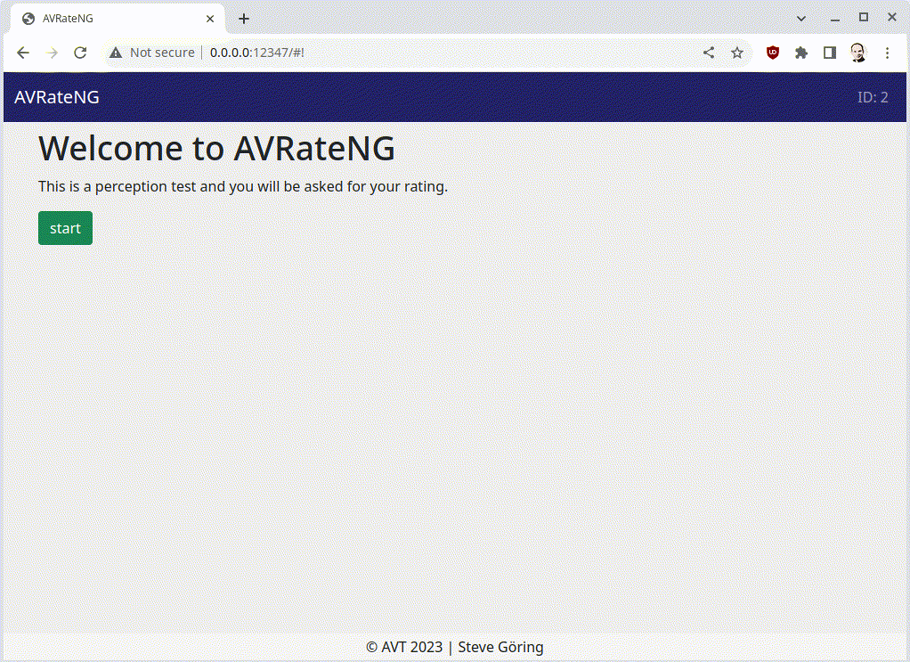

# AVRateNG


AVRateNG is a video, image, and general multimedia rating system, based on a simple web interface. AVRateNG is developed as part of the research in the [AVT Group](https://www.tu-ilmenau.de/en/audio-visual-technology/).

AVRateNG was inspired by [AVrate](https://github.com/Telecommunication-Telemedia-Assessment/AVRate).

If you want to implement an online test, please checkout [AVrate Voyager](https://github.com/Telecommunication-Telemedia-Assessment/AVrateVoyager)

# Requirements

* Operating system: Windows, Linux or macOS
* Python 3
    - Windows: you can use the provided Python 3 distribution and setup files in `thirdparty` folder
    - Linux: `sudo apt-get install python3`
    - macOS: Use [Homebrew](https://brew.sh/) and run `brew install python`

Furthermore you also need a player, e.g. for Linux (Ubuntu) or macOS you can use `mpv` (install it via `sudo apt-get install mpv` or `brew install mpv`); for Windows you can use the version that is stored in `thirdparty`.

## Plot script
For the `generate_plots.py` script you need pandas and seaborn:

    pip3 install pandas seaborn

Note: `generate_plots.py` is **experimental**.

## First steps

Before you should start with your specific processed media files, you should try to run AVRateNG. If you correctly checkout the repository, everything should work.

Just start `avrateNG.py` and open http://127.0.0.1:12347/ (preferred browser is Chrome/Chromium, it should work also with Firefox and Edge) in your favorite web browser:

```
./avrateNG.py
```

**NOTE for Chrome: Disable the "*Calculate windows occlusion on Windows*" option in chrome://flags**

The default credentials are:

- User: `max`
- Password: `123`

Change these in the `config.json` file.

All ratings are stored in a sqlite3 database. For a simple conversion you can use `convert_ratings_to_csv.py`. This script will create a `csv` file of all stored ratings and other data. It requires pandas to be installed.

## Configuration

### General settings
All general settings can be changed in `config.json`, e.g.

```
{
    "player": "thirdparty\\mpv-x86_64-20180429-git-dc16d85\\mpv.exe --fs \"{filename}\"", // default Windows player path, \"{filename}\" is a template for the video filename
    "player_linux": "mpv --fs '{filename}'",                                  // Linux player
    "http_user_name": "max",                                                  // user login name
    "http_user_password": "123",                                              // user password
    "http_port" : "12347",                                                    // http port where the service is running
    "rating_template" : "radio1.tpl",                                         // template that will be used , e.g. change it to "radio1.tpl"
    "playlist" : "playlist.list",                                             // Playlist file that will be used (Define your playlist here)
    "template_folder" : "templates",                                          // Folder with your custom templates (Take a look in "/templates/")
    "training" : true,                                                        //  Training stage up front? (true/false)
    "trainingsplaylist" : "training.list",                                    // if training is true, this trainingsplaylist will be presented
    "shuffle": true                                                           // Randomized playback of videos in playlist? (true: Randomization, false: linear playback according to playlist)
    "questionnaire": true,                                                    // include questionnair
    "gray_video": "videos/gray.mkv",                                          // show a gray video 
    "no_media_playback": false,                                               // deactivate media playout
    "question": "What is your opinion of the video quality?"                  // the question for the rating screen
}
```

### Player setup

You just need to change the `player` or `player_linux` value in the `config.json` to your favorite video player corresponding to your operating system, e.g. it also works with Media Player Classic, VLC or `ffplay`.

Please try use command line flags and no manually configured GUI settings, so that your experiment can be run without spending hours in configuration of the player.

#### Player experiences

* `mpv`: some problems with 4K content and 60 fps, and vp9
    * command line arguments: `-cache 8388608 -fs --cursor-autohide=0 --osc=no --no-input-default-bindings --hwdec=auto --ontop`
* Media Player Classic: problems with 4K, 60fps and vp9
* ffplay: slower than mpv for 4K
* VLC: slowest player ever (not yet tested with version 3.0)
* OptiPlay: the following command works:
```bash
thirdparty\OptiPlay-0.7beta1.exe -an -f v210 -video_size 3840x2160 -framerate 60 -i {filename}
```

### Playlist creation

The playlist `playlist.list` consists just of lines with corresponding video files, e.g.

```
./videos/01.mkv
./videos/02.mkv
```

You can also define a training playlist `training.list`.

The playlists to render are defined in the `config.json` file. Also set `training` to `true` or `false` in there.

#### Multiple videos per line

You can specify multiple videos in one playlist entry if you separate them by ` | ` (spaces are important).

```
./videos/01.mkv | ./videos/01.mkv
./videos/02.mkv
```

The configured player will now get as `{filename} = "./videos/01.mkv" "./videos/01.mkv"`.

#### Gray video

A 2 second gray video will be played before and after a video, for disabling
just remove `"gray_video": "..."` in your config file.

### Advanced command line flags

Just run `avrateNG.py -h` and you will get the following screen:

```
usage: avrateNG.py [-h] [-configfilename CONFIGFILENAME] [--standalone]
                   [--development]

AVRateNG

options:
  -h, --help            show this help message and exit
  -configfilename CONFIGFILENAME
                        configuration file name (default: config.json)
  --standalone          run as standalone version (default: False)
  --development, -d     run in dev mode (default: False)

stg7 2023
```

### Templates

There are several rating templates implemented, they can be changed in the `config.json`. Default template is a classic ACR rating scheme, see e.g. the folder `templates/rating/`.

### Analysis
For a first check how the output format could be used in a small analysis, check the jupyter notebook in the `analysis` folder

### Developers

* Steve Göring
* Rakesh Rao Ramachandra Rao
* Stephan Fremerey
* Maximilian Schaab
* Serge Molina
* Anton Schubert

### Contributers
* questionnair form: John Dumke and Margaret Pinson


### Acknowledgements

If you use this software in your research, please include a link to the repository and cite the following paper and the repository:

```bibtex
@inproceedings{goering2021voyager,
  title={AVRate Voyager: an open source online testing platform},
  author={Steve Göring and Rakesh {Rao Ramachandra Rao} and Stephan Fremerey and Alexander Raake},
  year={2021},
  booktitle={2021 IEEE 23st International Workshop on Multimedia Signal Processing (MMSP)},
  pages={1--6},
  organization={IEEE}
}
@online{AVRateNG,
  author    = {AVRateNG},
  title     = {AVRateNG -- github project},
  url     = {https://github.com/Telecommunication-Telemedia-Assessment/avrateNG},
}
```
### License

GNU General Public License v3. See [LICENSE](LICENSE) file in this repository.
