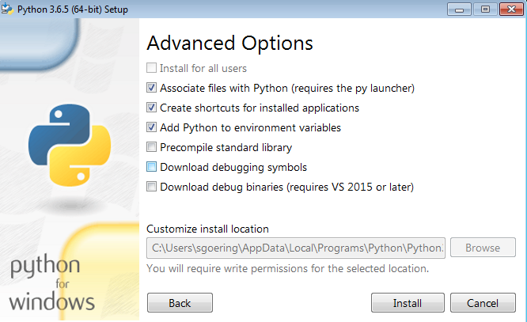

# AvrateNG for windows -- some notes

For windows, install the python 3.6.5. distribution, select custom install, and *important* select the "add python to environment path" box.

see 

Path changes will only be valid after a reboot

# Check

open `cmd.exe` and type `python` + enter, and you should get a valid python3 shell.

# first run
* open `cmd.exe` go to avrateNG folder,
* run `python avrateNG.py`
* a firewall window should appear, allow avrateNG to access network.

# general

use the `win_start_avrateng.bat` file to start avrateNG under windows